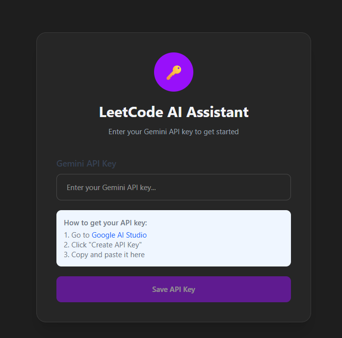
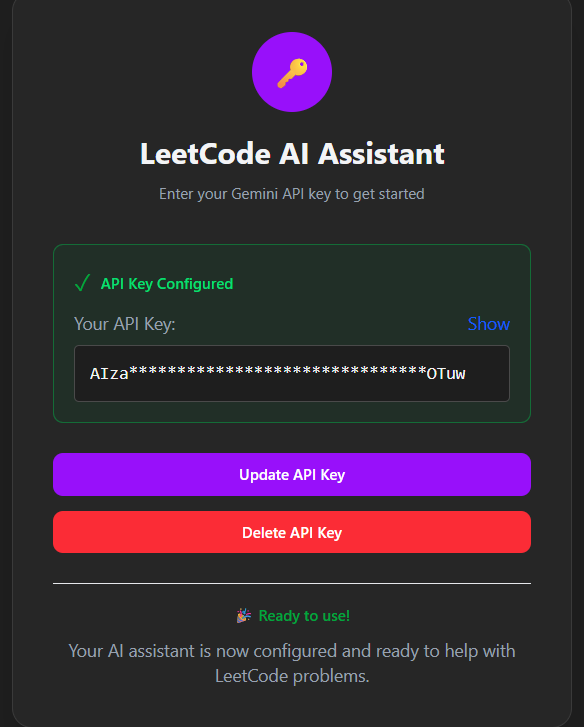
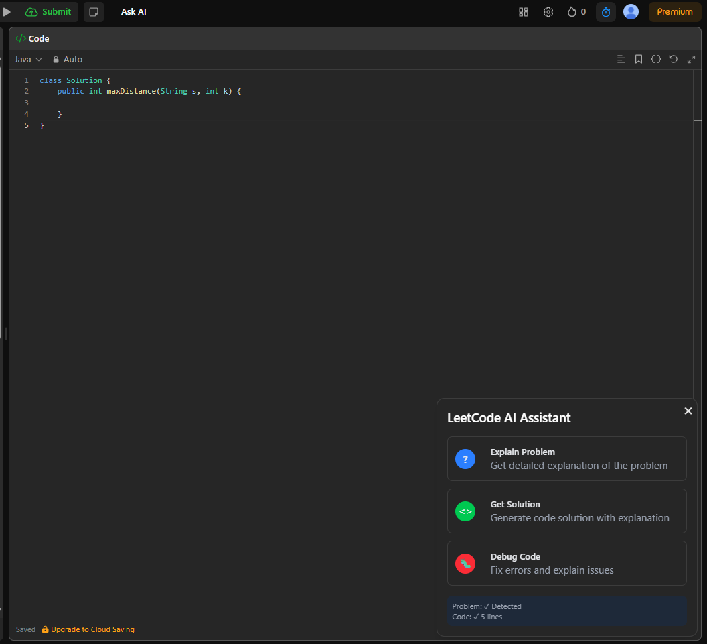

 
# LeetCode AI Assistant

A powerful Chrome extension that enhances your LeetCode experience with AI-powered assistance. Get instant problem explanations, code solutions, and debugging help right on the LeetCode platform.

## Features

### 🧠 **Three Core Functionalities**

1. **📖 Problem Explanation**
   - Detailed breakdown of problem requirements
   - Key concepts and algorithms explanation
   - Different solution approaches
   - Time/space complexity analysis
   - Edge cases identification

2. **💻 Code Solution & Explanation**
   - Complete working solutions in multiple languages
   - Step-by-step algorithm walkthrough
   - Code explanation with comments
   - Complexity analysis
   - Alternative approaches comparison

3. **🐛 Debug & Error Fixing**
   - Automatic error detection in your code
   - Fixed code with detailed explanations
   - Root cause analysis
   - Testing strategies
   - Best practice recommendations

### 🎯 **Smart Features**

- **Live Code Tracking**: Automatically detects your current code
- **Problem Detection**: Automatically identifies the current LeetCode problem
- **Real-time Updates**: Syncs with your coding progress
- **Secure API Management**: Safe storage of your Gemini API key
- **Clean UI**: Non-intrusive, modern interface

## 🚀 Installation

### Prerequisites
- Google Chrome browser
- [Gemini API Key](https://aistudio.google.com/app/apikey) (free)

### Setup Steps

1. **Clone the repository**
   ```bash
   git clone https://github.com/Ritikchauhan1704/leetcodeAIAssistant.git
   cd leetcodeAIAssistant
   ```

2. **Install dependencies**
   ```bash
   npm install
   # or
   bun install
   ```

3. **Build the extension**
   ```bash
   npm run build
   # or
   bun run build
   ```

4. **Load in Chrome**
   - Open Chrome and go to `chrome://extensions/`
   - Enable "Developer mode" (top right toggle)
   - Click "Load unpacked"
   - Select the `dist` folder from your project

5. **Configure API Key**
   - Click on the extension icon in Chrome toolbar
   - Enter your Gemini API key
   - Click "Save API Key"

## 🔑 Getting Your Gemini API Key

1. Visit [Google AI Studio](https://aistudio.google.com/app/apikey)
2. Sign in with your Google account
3. Click "Create API Key"
4. Copy the generated key
5. Paste it in the extension settings

**Note**: The API key is stored securely in your browser's local storage and never shared.

## Usage

### Getting Started

<p align="center">
  
</p>

<p align="center">
  
</p>

**First-time setup:** open the extension popup and **save your Gemini API key**. Once the key is saved you can start using the assistant.

1. **Open any LeetCode problem page**.
2. **Click the new “Ask AI” button** located in the top-bar next to the native *Run* / *Submit* buttons.

   
3. Pick one of the three AI features in the pop-up (Explain, Get Solution, Debug).

### Feature Overview

| Button | What it does |
| ------ | ------------ |
| 🧠 **Explain Problem** | Concise, step-by-step explanation of the problem, key concepts and constraints. |
| 💻 **Get Solution** | Generates a full working solution with explanation and complexity analysis. |
| 🐛 **Debug Code** | Analyzes your current code and streams back only the fixes (no full rewrite). |

<p align="center">
  
</p>

### Tips

* Responses stream in real-time – watch the answer grow line-by-line.
* You can switch back to the function menu with **← Back to functions**.
* Close the panel at any time with the global **✕** button.
* The assistant auto-detects your selected language in the LeetCode IDE and tailors responses accordingly.


## 🛠️ Technical Stack

- **Frontend**: React 18 + TypeScript
- **Styling**: Tailwind CSS
- **Build Tool**: Vite
- **AI Provider**: Google Gemini **Flash 2** (streaming)
- **Package Manager**: Bun (or npm)

## 📝 TODO

- Polish and modernize the UI (consistent dark theme, larger fonts)
- Streaming messages not working reliably → investigate Gemini stream handling & UI updates
- Add loading / error states for network issues
- Provide settings panel for model, theme, hotkeys
- Write unit tests for prompt generation & content scripts
- Prepare assets & listing for Chrome Web Store release

